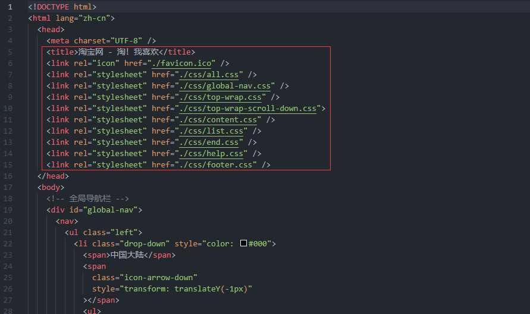

# 仅供交流学习使用，切勿用于商业盈利。

---

## 前言

在Internet飞速发展的今天，互联网成为人们快速获取、发布和传递信息的重要渠道，它在人们政治、经济、生活等各个方面发挥着重要的作用。因此网站建设在Internet应用上的地位显而易见，它已成为政府、企事业单位信息化建设中的重要组成部分，从而倍受人们的重视。我们当代大学生更是离不开网络给我们带来的好处与便利。但是，我们经常浏览的淘宝到底是如何制作的呢？我想这一点很多同学都没有去深究过。所以，我选择了 “1:1还原淘宝” , 本项目的设计目的是通过实践使我们能够亲身经历网页制作的全过程。通过设计达到掌握网页设计、制作的技巧。

此外，掌握 Photoshop、Visual Studio Code 等软件的的操作和应用，将会使你的开发周期大幅缩短，效率更上一层楼。

## 技术栈介绍

本次开发使用原生WEB技术：HTML5、CSS3、JavaScript (ES6+)  
使用到的技巧：弹性盒模型、无缝轮播图、CSS Sprites、二级导航、图片懒加载


## 结构设计

打开淘宝我们可以清晰地看到一个侧面导航栏（绿色框）、两个轮播图（红色框）、用户信息栏（黑色框）、搜索框（蓝色框）、全局顶栏（紫色框）这几个板块：


我们往下滚动发现下方的布局是一致的（有鼠标浮动效果），但上方的导航栏发生了变化：


他的页脚是这样的：


通过这些，我们可以大致了解到他的布局结构。此外我还发现，淘宝页面设置了最小宽度。

## 建立布局

因为要写很多的 CSS，所以布局要分为很多个单独的模块。我们不能把所有的 CSS 都写进一个文件里。我们将每个板块的 CSS 样式都写进一个单独的文件里，最后通过 link 标签将所有布局文件引入。但这回导致请求数量增大，所以在后期上线的时候需要合并这些零散的 CSS 文件，但这又给我们在技术上提了一个要求：尽可能的限制样式生效的范围、CSS权重的叠加等。这么做可以大幅度降低样式污染的可能，也为日后的维护扫清了障碍。



## 技术细节

#### 弹性盒模型

Flex布局使得子项目能够“弹性”的改变其高宽，自由填充容器剩余空间，以适应容器变大，或者压缩子项目自身，以适应容器变小；同时还可以方便的调节子项目方向和顺序。flex常用于高宽需要自适应, 或子项目大小成比例, 或水平垂直对齐等场景。众所周知 Web layout 是 Web UI 中的基础架构，重要性不言而喻。传统的盒模型，借助 display、position、float 属性应对普通布局游刃有余，但针对复杂的或自适应布局，常常捉襟见肘。比如垂直居中，就是一个老大难的问题，借助flex弹性盒模型，两行代码就可以优雅的实现之。详情参阅：[这里](https://segmentfault.com/a/1190000009061028)

#### 无缝轮播图


“无缝” 的原理如上，实现起来并不难。要点在我们需要一个 “节流阀” 来防止用户高频连点：利用一个变量 allow: boolean 来控制是否允许轮播，添加一个判断条件，allow 为 true 时才执行逻辑，在执行的轮播逻辑内将 allow 设为 false，在轮播逻辑外部设置一个定时器，1秒后再将 allow 设置为 true，这样就可以保证一秒最多触发一次滚动函数：

```JavaScript
// 默认允许滚动
let allow = true

// 判断是否允许滚动
if (allow) {
  // 禁止再次滚动
  allow = false
  // 滚动逻辑...
}

// 一秒后执行
setTimeout(() => {
  // 允许再次滚动
  allow = true
}, 1000)
```

#### CSS Sprites

CSS Sprites 在国内很多人叫 CSS 精灵，是一种网页图片应用处理方式。它允许你将一个页面涉及到的所有零星图片（非常小的图片，通常只有几kb）都包含到一张大图中去，这样一来，当访问该页面时，载入的图片就不会像以前那样一幅一幅地慢慢显示出来了。而且还能大幅减少请求数量。
将大图设置为一个元素（此元素存在宽高）的背景，然后使用 background-position 来设置背景的位置即可实现 CSS Sprites 。

#### 二级导航

下面是一个非常简单的二级导航示例：

```html
<!DOCTYPE html>
<html lang="zh-CN">
<head>
  <meta charset="UTF-8">
  <meta name="viewport" content="width=device-width, initial-scale=1.0">
  <title>二级导航</title>
  <style>
    .two {
      display: none;
    }
    .show:hover ul.two {
      display: block;
    }
  </style>
</head>
<body>
  <ul>
    <li>一级导航</li>
    <li>一级导航</li>
    <li>一级导航</li>
    <li class="show">二级导航
      <ul class="two">
        <li>二级导航</li>
        <li>二级导航</li>
        <li>二级导航</li>
        <li>二级导航</li>
      </ul>
    </li>
  </ul>
</body>
</html>
```

#### 图片懒加载

如今的浏览器，已经原生支持懒加载。目前只有最新 chromium 内核的浏览器支持此属性，不过全面兼容是迟早的事情。就如同 CSS Grid 布局一样，从一开始寥寥无几的支持，到现在家喻户晓。那么如何实现呢？，很简单：

```html
<!DOCTYPE html>
<html lang="zh-CN">
<head>
  <meta charset="UTF-8">
  <meta name="viewport" content="width=device-width, initial-scale=1.0">
  <title>二级导航</title>
</head>
<body>
  <!-- 为 img 标签添加 loading="lazy" 属性就可实现懒加载 -->
  
</body>
</html>
```

详情参阅 [这里](https://web.dev/browser-level-image-lazy-loading/)

## 开源协议

[GPL3.0](https://opensource.org/licenses/GPL-3.0)