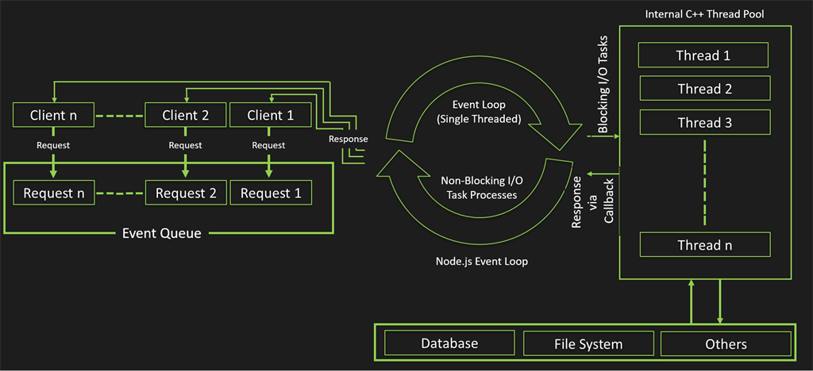
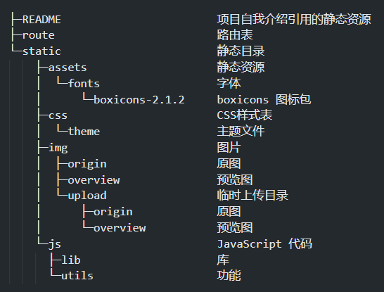

# 网页电子相册

## 简介
---
使用原生 WEB 技术实现一个网页电子相册  
前端: JavaScript  
服务端: Node.js  
数据库: 业务逻辑不复杂，采用 JSON 建立图片数据索引

## WEB端
---
每个页面都有很多张图片，对于呈现在可视范围内的图片我们可以通过放置一张降低画质的预览图来代替此举不仅降低了服务端的带宽开销也非常有效的缓解了浏览器显示大量高清图片卡顿的问题，对于那些不显示在可视范围内的图片我们可以使用懒加载技术延迟加载。电子相册的前端UI设计采用新拟态风格，采用响应式数据的方式来监听页码变化以请求新的数据。

## 关于前后端分离
---
web1.0 时代，网页仅仅是向人们展示内容，作为用户我们也只能浏览。此时后端代码与前端代码混写没有太大的代价。而到了 web2.0 时代，页面的交互变得逐渐复杂，此时后端代码与前端代码混写会使得后期的维护变的非常困难。

例如在传统的 PHP WEB 开发过程中，一个网页不是由后端开发者来独立完成的：  
前端开发 -> HTML静态页面 -> 后端开发 -> PHP

前端会把页面做出来，我们后端需要开发，就把前端页面嵌入到 PHP 中，也需要添加标签才能把数据整合起来。因为核心就是：如何把我们后端返回的数据添加到页面中，无论是 PHP、ASP、JSP 模板都一样。

如果此时网页遇到一些问题，我们把 PHP 发给前端开发，前端开发人员看不懂 PHP。此时前端也不好解决，后端也不好解决。这样沟通和开发效率非常低，前后端的代码耦合度太高，无论是开发还是维护起来都非常麻烦。

web2.0 时代的前端已经演化成了“大前端”，各类框架的出现进一步推动了前后端分离开发的主流趋势。伴随着 Angluar, React, Vue 等数据驱动视图的框架出现和 webpack、node 的出现彻底解决了 web1.0 时代前后端代码高度耦合的问题。

现在的前端只需要独立编写客户端代码，后端也只需要独立编写服务端代码提供数据接口即可。
前端通过 AJAX、Fetch 请求来访问后端的数据接口，然后将 Model 展示到 View 中即可。

这就是我们说的前后端分离开发，而代价则是更多的请求数量。

## 服务端
---
> 每个 Node.js 进程只有一个主线程在执行程序代码，会形成一个执行栈（execution context stack）。
>
> 主线程之外，还维护了一个“事件队列”（Event Queue）。当用户的网络请求或者其它的异步操作到来时，Node.js 都会把它放到 Event Queue 之中，此时并不会立即执行它，代码也不会被阻塞，继续往下走，直到主线程代码执行完毕。
>
> 主线程代码执行完毕完成后，然后通过事件循环机制（Event Loop），开始到 Event Queue 的开头取出第一个事件，从线程池中分配一个线程去执行这个事件，接下来继续取出第二个事件，再从线程池中分配一个线程去执行，然后第三个，第四个。主线程不断的检查事件队列中是否有未执行的事件，直到事件队列中所有事件都执行完了，此后每当有新的事件加入到事件队列中，都会通知主线程按顺序取出交 Event Loop 处理。
> 
> 当有事件执行完毕后，会通知主线程，主线程执行回调，线程归还给线程池。
>
> 主线程会不断重复上面的第三步，直到所有代码执行完毕。这就是我们说的“事件驱动”。



为了处理高并发请求，服务端要尽可能的使用异步编程的方式来处理前端的请求。最重要的一点就是代码风格需标准且尽量模块化。由于 Node.js 进程只有一个主线程在执行程序代码，所以 Node.js 是单线程的。但得益于 Node.js 的异步编程方法，使得 Node.js 处理高并发请求比传统的PHP等语言快一倍还多。也正因为需要处理较高负载的高并发请求，所以服务端使用 Node.js 编写。

单线程的优势: 
- 多线程占用的内存更多
- 多线程间的切换使得 CPU 开销大
- 多线程由内存同步开销
- 编写单线程程序简单
- 线程安全问题

单线程的劣势: 
- CPU 密集型任务占用 CPU 时间长（可通过 cluster 方式解决）
- 无法利用 CPU 的多核（可通过 cluster 方式解决）
- 单线程抛出异常使得程序停止（可通过 try catch 方式捕获异常或自动重启机制解决）

npm（node package manager）是一个 Node.js 包管理和分发工具，已经成为了非官方的发布Node模块（包）的标准。  
2020年3月17日，Github 宣布收购 npm，GitHub 现在已经保证 npm 将永远免费。

npm 是随同 Node.js 一起安装的包管理工具，能解决 Node.js 代码部署上的很多问题，常见的使用场景有以下几种：
- 允许用户从 npm 服务器下载别人编写的第三方包到本地使用。
- 允许用户从 npm 服务器下载并安装别人编写的命令行程序到本地使用。
- 允许用户将自己编写的包或命令行程序上传到 npm 服务器供别人使用。

## 项目目录结构介绍
---


## 前端代码分析 
### Elements.js 介绍
---
Elements.js 导出一个对象，对象内包含了一些高频操作的 DOM 元素。以下为对象属性介绍：  
pageNumber: 页码元素  
mainContent: 页面容器  
navHome: 导航栏的首页按钮  
navFavorite: 导航栏的收藏按钮
navUpload: 导航栏的上传按钮  
theme: 主题 link 标签  
themeSwitcher: 主题切换按钮

### Reactive.js 介绍
---
Proxy 是 JavaScript 中的原生对象，用来创建一个对象的代理，可以实现基本操作的拦截和自定义。这也是 Vue3.0 的核心所在。
基本使用：
``` JavaScript
// target 是被代理的对象
// handler 是对象类型，里面需要实现 get 和 set 方法
const demo = new Proxy(target, handler)
```
getter：
``` JavaScript
const obj = {
  value: 0
}
const demo = new Proxy(obj, {
  /**
   * 此方法在访问对象属性时触发
   * target:      被代理的对象
   * key:         要访问的属性名
   * target[key]  要访问的值
   */
  get: (target, key) => {
    // 此函数内 return 的任何内容都将作为被访问的结果
    return 999
  }
})

console.log(demo.value) // 打印 999 （第 216 行 return 了 999）
```
setter:
``` JavaScript
const obj = {
  value: 0
}
const demo = new Proxy(obj, {
   /**
   * 此方法在访问对象属性时触发
   * target:      被代理的对象
   * key:         要访问的属性名
   * target[key]  要访问的值
   */
  get: (target, key) => {
    // 此函数内 return 的任何内容都将作为被访问的结果
    return target[key] // 返回真实的值
  },
  /**
   * 此方法在修改对象属性时触发
   * target:      被代理的对象
   * key:         要修改的属性名
   * target[key]  旧的值
   * newValue     新的值
   */
  set: (target, key, newValue) => {
    // 在此函数内为 target[key] 赋值
    target[key] = 9999
    // return true 代表 set 操作已完成，没有这句话可能会收到一个报错。
    return true
  }
})
demo.value = 10
console.log(demo.value) // 打印 9999 （第 249 行将 9999 赋值给了 target[key]）
```
一个标准的示例：
``` JavaScript
const obj = {
  value: 0
}
const demo = new Proxy(obj, {
  get: (target, key) => {
    console.log(`访问了 ${key} 属性`)
    return target[key]
  },
  set: (target, key, newValue) => {
    console.log(`将 ${key} 属性的值从 ${target[key]} 修改为 ${newValue}`)
    target[key] = newValue
    return true
  }
})
demo.value = 10
// 控制台输出：将 value 属性的值从 0 修改为 10

console.log(demo.value)
// 控制台输出：访问了 value 属性
// 控制台输出：10
```
最后，封装为模块：
``` JavaScript
/**
 * Reactive
 * @description 基于 Proxy 封装的数据劫持工具
 * @param {*} val 传入一个值或对象
 * @param {function(target, key, newValue)} callback callback(target, key, newValue)
 * @returns Proxy Object
 */
const reactive = (val, callback) => {
  let reactiveData = {}

  // proxy只能代理对象，所以需要将非对象类型的数据包装成对象
  if (typeof(val) !== 'object') reactiveData.value = val
  else reactiveData = val

  return new Proxy(reactiveData, {
    get: (target, key) => target[key],
    set: (target, key, newValue) => {
      // 将这三个参数传递给回调函数，由外部处理
      callback(target, key, newValue)
      return true
    }
  })
}

// 导出为模块
export default reactive
```

### Request.js 介绍
---
Elements.js 导出一个对象，对象内包含了所有有关网络请求的函数：  
``` JavaScript
reqImages(页码, all|fav)        // 获取图片
reqMarkImages(文件名, 标记类型)  // 标记图片
reqDeleteImages(文件名)         // 删除图片
reqUploadImages(files对象)      // 上传图片
``` 

### ClickEvents.js 介绍
---
此模块内包含所有点击事件处理的函数。

### MainContentTemplate.js  介绍
---
图片是以卡片的形式展现的，此文件是卡片的 html 模板。图片的文件名在 data-name 属性里，这也是网页如何根据文件名进行操作的要点。


## 后端代码分析
### 为什么使用 express
---
express 是一个基于 Node.js 平台的 WEB 应用开发框架，它提供了一系列的强大特性，可以帮助我们创建各种 WEB 应用。

举个不是很恰当的例子：  
使用原生 Node.js 搭建一个简易 WEB 服务器，其具备首页和登录页面：
``` JavaScript
const http = require('http')

// 创建 http 服务器
const app = http.createServer((req, res) => {
  // 根据请求的 url 判断访问的是哪个页面
  if (req.url == '/' || req.url == '/index.html') { // 首页路由
    // 设置响应头（响应 html 格式的内容）
    res.writeHead(200, {'Content-Type': 'text/html; charset=UTF8'})
    // 响应 html 格式的内容
    res.end('<h1>首页</h1>')
  }
  if (req.url == '/login') {   // 登录路由
    // 设置响应头（响应 html 格式的内容）
    res.writeHead(200, {'Content-Type': 'text/html; charset=UTF8'})
    // 响应 html 格式的内容
    res.end('<h1>登录页面</h1>')
  }
})

// 监听 8000 端口
app.listen(8000, () => {
  console.log('Server running at http://127.0.0.1:8000')
})
```
使用 express 搭建一个简易 WEB 服务器，其具备首页和登录页面：
``` JavaScript
const express = require('express')
const app = express()

// 首页路由
app.get('/', (req, res) => {
  // 响应 html 格式的内容
  res.end('<h1>首页</h1>')
})

// 登录路由
app.get('/login', (res, req) => {
  // 响应 html 格式的内容
  res.end('<h1>登录页面</h1>')
})

// 监听 8000 端口
app.listen(8000, () => {
  console.log('Server running at http://127.0.0.1:8000')
})
```
由此也可以看出，使用了 express 框架的代码更加简洁、易懂。

### 官方的中间件
---
项目里使用到的官方提供的中间件
``` JavaScript
// 静态目录
app.use('映射到的网络路径', express.static('静态目录的本地路径'))
// 解析 JSON 格式的请求体数据
app.use(express.json())
// 解析 URL-encoded 格式的请求体数据（x-www-form-urlencoded 表单支持）
app.use(express.urlencoded({ extended: false }))
```

### fs-extra 模块
---
fs-extra 是一个文件操作模块，支持回调和Promise。至于为什么使用 fs-extra 而不是原生的 fs 。我们看了使用方法的对比才能明白。

原生 fs 模块：
``` JavaScript
const fs = require('fs')
// fs 模块只能一层一层的创建目录，如果上层目录不存在则会抛出一个错误。

// 回调地狱
fs.mkdir('/a', (err) => {
  if (err) console.log(err)
  console.log('创建成功')
  fs.mkdir('/a/b', (err) => {
    if (err) console.log(err)
    console.log('创建成功')
    fs.mkdir('/a/b/c', (err) => {
      if (err) console.log(err)
      console.log('创建成功')
      fs.mkdir('/a/b/c/d', (err) => {
        if (err) console.log(err)
        console.log('创建成功')
        fs.mkdir('/a/b/c/d/e', (err) => {
          if (err) console.log(err)
          console.log('创建成功')
        })
      })
    })
  })
})  // 当然，这种情况可以通过递归解决，但终归还是不够优雅。

// 同步方法执行
try {
  fs.mkdirSync('/a')
  fs.mkdirSync('/a/b')
  fs.mkdirSync('/a/b/c')
  fs.mkdirSync('/a/b/c/d')
  fs.mkdirSync('/a/b/c/d/e')
} catch (error) {
  console.log(error)
}
```
fse 模块：
``` JavaScript
const fse = require('fs-extra')
// ensureDir 方法，存在则什么都不做，不存在则创建

// Promise 写法
fse.ensureDir('/a/b/c/d/e').then(() => {
  console.log(err)
}).catch((err) => {
  console.log(err)
})

// 回调写法
fse.ensureDir('/a/b/c/d/e', (err) => {
  if (err) console.log(err)
})

// Async/Await 写法
async function example(directory) {
  try {
    await fs.ensureDir(directory)
    console.log('success!')
  } catch (err) {
    console.error(err)
  }
}
example('/a/b/c/d/e')
```
由此可以看出 fse 更加灵活易用。

### compression 模块
---
扩展 express 使得 express 支持 http 的 gzip 传输。（更加节省用户和服务器的带宽）
``` JavaScript
const express = require('express')
const compression = require('compression')
const app = express()

// 启用 gzip 压缩传输
app.use(compression())
```
实测，通过此方式传输的文本，最高节省 40% 左右的带宽开销。

### morgan 模块
---
扩展 express 使得 express 支持日志记录功能。（服务端必备）
``` JavaScript
const express = require('express')
const morgan = require('morgan')
const app = express()

// 启用 web 日志（日志级别：dev）
app.use(morgan('dev'))
```

### session 模块
---
扩展 express 使得 express 支持 session。（服务端必备，用于保存用户登录状态）
``` JavaScript
const express = require('express')
const session = require('express-session')
const app = express()

// 配置 session
app.use(session({
  secret: '!2@3$5%6', // 加密签名
  name: 'id', // 客户端 cookie 名
  resave: false, // 禁止重置会话
  saveUninitialized: false, // 强制保存未初始化的会话
  rolling: true, // 每个请求都会强制 cookie 从而重置 cookie 的有效时间
  cookie: {
    httpOnly: true, // 仅允许服务器修改 cookies
    maxAge: 1000 * 1800, // cookie 有效时间（1000ms * 1800 = 30min）
    secure: false // 仅允许通过 https 传输（更安全）
  }
}))
```

### sharp 模块
---
用于图片格式转换
``` JavaScript
const sharp = require('sharp')

// 转换为 jpg 格式的图片
sharp(源文件路径)
  .jpeg({
    quality: 50 // 图片质量
  })
  .toFile(输出路径)
  .catch((rea) => new Error(rea))
```

### /route/image.js 模块
---
express 官方提供的一种模块化路由的方法，将路由规则与逻辑写进这里，然后再入口文件内导入此模块即可使用。
示例：
``` JavaScript
/**
 * route.js
 */
const express = require('express')
const app = express.Router()

app.get('/', (req, res) => {
  res.end('hello word')
})

module.exports = app
```
``` JavaScript
/**
 * app.js
 */
const express = require('express')
const app = express()
const myRoute = require('./route.js')

// 此处还可以设置 url 前缀
// 如果是 app.use('/a/', myRoute) 则 myRoute 内的 app.get('/b') 就等同于 app.get('/a/b')
app.use('/', myRoute)

app.listen(3000, () => {
  console.log('Server running at http://127.0.0.1:3000')
})
```